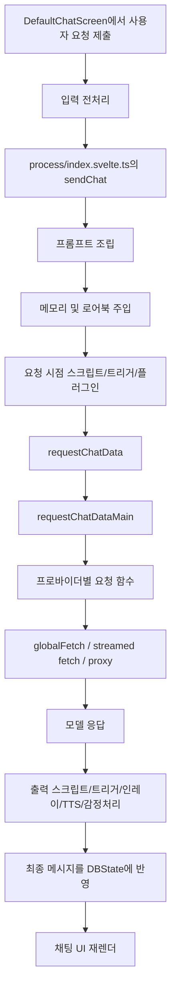
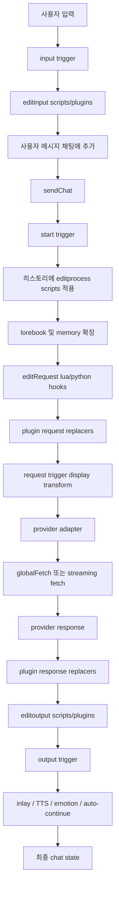

# RisuAI 아키텍처 및 요청 흐름 분석

> 포팅 작업의 기준 문서: `docs/risuai-android-background-runtime-handoff.ko.md`
>
> Android 앱 포팅 관련 후속 세션은 이 문서를 먼저 읽고 시작해야 한다.
> 이 작업의 제1원칙은 "새 시스템 설계"가 아니라 "기존 RisuAI의 요청 오너만 background runtime으로 이동시키는 포팅"이다.
> 요청 로직의 의미, 순서, 확장 지점, 생태계 호환성은 유지되어야 한다.

## 목적

이 문서는 프로젝트를 원본 RisuAI 기준 상태로 되돌린 뒤, 현재 저장소 구조를 다시 기준점으로 삼아 분석한 결과다.

핵심 질문은 세 가지다.

1. 프로젝트의 전체 구조는 어떻게 되어 있는가?
2. 사용자의 요청은 실제로 어떤 경로로 흐르는가?
3. 캐릭터, 모듈, 스크립트, 트리거, 플러그인은 그 흐름 어디에 개입하는가?

이 문서는 이후 서버사이드 구조 변경을 하기 전에, 공통된 이해를 맞추기 위한 기반 문서다.

## 기준 요약

- 프런트엔드 런타임: Svelte 5 + TypeScript
- 데스크톱 런타임: Tauri
- 셀프호스트 런타임: Node 서버가 브라우저 앱을 서빙하는 구조
- 핵심 채팅 오케스트레이션: `src/ts/process/index.svelte.ts`
- 요청 디스패치 계층: `src/ts/process/request/request.ts`
- 저장소 추상화: `src/ts/storage/autoStorage.ts`
- Node 셀프호스트 서버: `server/node/server.cjs`

가장 중요한 기준 사실은 다음이다.

> 원본 상태의 RisuAI에서 Node 셀프호스트 서버는 메인 생성 런타임이 아니다.  
> 브라우저 앱이 여전히 프롬프트를 조립하고, 스크립트/트리거/플러그인을 실행하며, 모델 요청도 수행한다.  
> Node 서버는 정적 호스팅, 인증된 파일 저장, 리버스 프록시, OAuth 보조 기능을 주로 담당한다.

이 사실이 이후 서버사이드 전환 설계의 출발점이 되어야 한다.

## 런타임 구도

### 1. 웹 모드

- 브라우저가 앱을 로드한다.
- 로컬 저장은 LocalForage 또는 OPFS를 사용한다.
- 원격 모델 요청은 대체로 공식 프록시 또는 허브 경로를 거친다.

### 2. Tauri 모드

- UI는 여전히 브라우저 기반이지만, 파일시스템과 네트워크 권한은 Tauri가 제공한다.
- 저장은 앱 데이터 디렉터리를 사용한다.
- 네트워크는 Tauri HTTP 및 streamed fetch 경로를 사용할 수 있다.

### 3. Node 셀프호스트 모드

- Node가 빌드된 프런트엔드를 서빙하고 `globalThis.__NODE__ = true`를 주입한다.
- 브라우저 앱은 `src/ts/platform.ts`에서 node 모드를 감지한다.
- 저장은 `NodeStorage`로 전환되어 `/api/read`, `/api/write`, `/api/list`, `/api/remove`를 사용한다.
- 모델 요청은 여전히 브라우저 런타임에서 시작되며, 주로 `/proxy` 또는 `/proxy2`를 경유한다.

## 최상위 구조

### 앱 부트스트랩

- 진입점: `src/main.ts`
- `App.svelte`를 마운트한다.
- `src/ts/bootstrap.ts`의 `loadData()`를 호출한다.
- 핫키를 초기화한다.

### 실제 부팅 책임

`src/ts/bootstrap.ts`가 실질적인 앱 초기화 대부분을 맡는다.

- 저장소 백엔드 초기화
- 데이터베이스 상태 로드 및 디코드
- 백업 복구
- 계정 동기화 연결 여부 처리
- 브라우저 모드 서비스 워커 등록
- 플러그인 로드
- GUI 및 테마 상태 갱신
- DOM observer 시작
- cold storage 구성
- 모듈 상태 갱신

즉, 일반적인 채팅 기능을 쓰기 전부터 앱은 이미 상당한 상태를 갖고 있고, 플러그인과 모듈도 초기에 로드된다.

### UI 셸

`src/App.svelte`는 최상위 모드 스위처 역할을 한다.

- 로딩 화면
- 최초 설정 플로우
- 설정 화면
- 모바일 레이아웃
- 데스크톱 레이아웃
- 각종 오버레이, 경고창, 플러그인 UI, 팝업

실제 채팅 UI는 `src/lib/ChatScreens/` 아래에 있다.

## 핵심 상태 모델

이 프로젝트는 Svelte store와 Svelte 5 runes 기반 공유 상태를 혼합해서 사용한다.

`src/ts/stores.svelte.ts`의 핵심 상태는 다음과 같다.

- `DBState`: 인메모리 데이터베이스 객체
- `selectedCharID`: 현재 선택된 캐릭터 또는 그룹
- `loadedStore`: 앱 부팅 완료 여부
- `alertStore`: 전역 알림 모달 상태
- `bodyIntercepterStore`: 요청 body 변형 훅
- `ReloadGUIPointer` / `ReloadChatPointer`: 명시적 갱신 신호

중요한 점은, 많은 시스템이 불변 결과를 반환하기보다 전역 상태를 직접 변경한다는 것이다.

## 데이터 및 저장 구조

### 데이터베이스 형상

`src/ts/storage/database.svelte.ts`는 장기 보관 데이터베이스 구조를 정의하고 기본값을 채운다.

여기에는 다음이 포함된다.

- 캐릭터와 그룹 채팅
- 프리셋과 프롬프트 설정
- 플러그인과 모듈
- 메모리 설정
- 모델/프로바이더 설정
- UI 설정
- 계정 동기화 메타데이터

### 저장소 추상화

`src/ts/storage/autoStorage.ts`는 런타임에 따라 백엔드를 선택한다.

- Node 셀프호스트 브라우저 모드에서는 `NodeStorage`
- 최신 브라우저 환경에서는 `OpfsStorage`
- 일반 브라우저 fallback은 `localforage`
- 계정 동기화가 켜지면 `AccountStorage`

### Node 저장소

`src/ts/storage/nodeStorage.ts`는 클라이언트가 생성한 짧은 수명의 ECDSA 서명 토큰을 이용해 Node 서버에 파일 작업을 요청한다.

Node 서버의 관련 엔드포인트는 `server/node/server.cjs`에 있다.

- `/api/test_auth`
- `/api/login`
- `/api/set_password`
- `/api/crypto`
- `/api/read`
- `/api/write`
- `/api/list`
- `/api/remove`

즉, 원본 Node 모드는 브라우저 앱의 원격 저장/프록시 보조 역할에 가깝다.

## 요청 흐름: 상위 개요

주 채팅 요청 경로는 UI에서 시작해 다시 UI 상태 저장소로 돌아온다.

## UI 진입 경로

일반적인 사용자 전송 액션은 `src/lib/ChatScreens/DefaultChatScreen.svelte`에 있다.

### `sendChat()` 이전에 일어나는 일

`sendMain()`은 실제 요청 엔진에 들어가기 전에 다음을 수행한다.

- 이미 생성 중이면 거절
- 슬래시 명령 처리
- 첨부 파일을 inlay marker로 변환
- 현재 캐릭터의 input trigger 실행
- 사용자 메시지에 `processScript(..., 'editinput')` 적용
- 사용자 메시지를 채팅 상태에 추가
- 입력창 초기화
- `sendChat(-1, ...)` 호출

즉, 요청 파이프라인은 이미 여러 확장 레이어가 채팅을 건드린 뒤에 시작된다.

## 핵심 생성 파이프라인

메인 오케스트레이터는 `src/ts/process/index.svelte.ts`의 `sendChat()`이다.

이 함수는 네 단계로 나눠 이해하는 것이 가장 쉽다.

### 1단계: 프롬프트 구성

주요 역할:

- 현재 캐릭터 또는 그룹 대상 해석
- preset chain 처리
- multiuser peer 안전성 처리
- 현재 채팅 및 generation metadata 계산
- 프롬프트 조각 구성:
  - main prompt
  - jailbreak
  - global note
  - author note
  - description
  - lorebook
  - persona prompt
  - post-everything 지시문
- 첫 메시지 및 예시 메시지 추가
- 채팅 히스토리를 `OpenAIChat[]`로 변환
- inlay, asset, multimodal 데이터 정리
- `start` trigger 실행
- `processScriptFull(..., 'editprocess')`로 정규식/스크립트 후처리

이 단계의 산출물:

- 토큰 추정치
- 구조화된 프롬프트 조각
- `OpenAIChat[]` 히스토리
- generation metadata

### 2단계: 메모리 삽입 및 토큰 맞춤

설정에 따라 하나의 메모리 시스템이 실행된다.

- `hanuraiMemory`
- `hypaMemoryV2`
- `hypaMemoryV3`
- `supaMemory`

이들은 다음을 수행할 수 있다.

- 이전 대화를 요약 또는 압축
- 메모리 항목을 프롬프트 히스토리에 삽입
- 채팅 레코드 안의 메모리 상태를 갱신

메모리가 꺼져 있으면, 이전 removable 메시지를 잘라내는 방식으로 토큰을 맞춘다.

### 3단계: 최종 프롬프트 형식화 및 모델 요청

여전히 `sendChat()` 내부에서 다음이 이어진다.

- prompt template 또는 formatting order 기준으로 프롬프트 조합
- depth prompt 삽입
- `runLuaEditTrigger(..., 'editRequest', formated)` 실행
- 토큰 재검사
- 출력 토큰 추정
- `requestChatData(...)` 호출

이 지점이 실제 요청 경계다.

### 4단계: 응답 처리 및 후처리

`requestChatData()`가 반환된 뒤에는 다음이 수행된다.

- 스트리밍 또는 일괄 응답 처리
- 지속적으로 `processScriptFull(..., 'editoutput')` 적용
- 라이브 채팅 상태에 메시지 반영
- `output` trigger 실행
- inlay screen 처리
- 선택적 TTS
- 선택적 auto-continue
- 선택적 감정 분류 후속 요청
- 선택적 이미지 생성 후속 처리
- generation timing metadata 마무리

즉, 최종 응답은 단순한 provider 응답이 아니라, 로컬 후처리 레이어가 겹친 결과물이다.

## 요청 디스패치 계층

`src/ts/process/request/request.ts`는 모델 요청 디스패치 허브다.

## `requestChatData()`

이 함수는 provider 호출을 감싸는 상위 wrapper다.

주요 역할:

- fallback model 로드
- MCP tool 로드
- plugin 요청 replacer 적용: `pluginV2.replacerbeforeRequest`
- request trigger를 display mode로 실행
- `requestChatDataMain()` 호출
- plugin 응답 replacer 적용: `pluginV2.replacerafterRequest`
- 금지 문자셋 재시도 규칙 적용
- 요청 재시도 처리

즉, provider adapter를 건드리지 않고도 요청 동작 전체가 바뀔 수 있다.

## `requestChatDataMain()`

이 함수는:

- 활성 모델 ID 결정
- 모델 메타데이터 결정
- 모델별 파라미터 적용
- 모델 flag에 맞게 채팅 재포맷
- provider format에 따라 실제 구현 함수로 분기

대표 대상:

- OpenAI-compatible
- Anthropic
- Google / Vertex
- NovelAI
- Ooba
- Kobold
- Ollama
- Horde
- WebLLM
- plugin provider

## 네트워크 실행 계층

실제 네트워크 경계는 `src/ts/globalApi.svelte.ts`에 있다.

여기에는 크게 두 종류가 있다.

### JSON 스타일 요청 경로: `globalFetch()`

`globalFetch()`는 일반적인 provider 요청을 어디로 보낼지 결정한다.

- 일반 브라우저 `fetch`
- userscript가 제공한 fetch
- Tauri HTTP
- proxy fetch

또한 `bodyIntercepterStore`를 통해 요청 body를 수정할 수 있다.

### 스트리밍 요청 경로

같은 파일의 streamed fetch 계열은 다음 중 하나를 택한다.

- userscript fetch
- Tauri streamed fetch
- proxy streamed fetch
- 일반 브라우저 fetch

웹 모드에서는 주로 공식 hub proxy를 거친다.  
Node 셀프호스트 모드에서는 주로 로컬 `/proxy` 또는 `/proxy2`를 쓰지만, 호출 주체는 여전히 브라우저 앱이다.

## 원본 상태에서 Node 서버의 역할

`server/node/server.cjs`가 제공하는 것은 다음이다.

- 빌드된 프런트엔드 정적 호스팅
- 요청 프록시 엔드포인트:
  - `/proxy`
  - `/proxy2`
  - `/hub-proxy/*`
- 인증된 파일 저장 API
- 비밀번호 초기 설정 및 로그인
- OAuth 보조 엔드포인트

반대로 원본 상태의 Node 서버가 **하지 않는 것**은 다음이다.

- 프롬프트 구성 소유
- 트리거 실행 소유
- 플러그인 실행 소유
- regex/lua/python 후처리 소유
- 최종 채팅 상태 변이 소유

이 구분이 핵심이다.

## 확장 지점

RisuAI에는 여러 확장 시스템이 있고, 이들은 서로 분리되어 있지 않고 요청 경로에 겹겹이 얹힌다.

### 1. 정규식 및 스크립트 변환

관련 파일:

- `src/ts/process/scripts.ts`
- `src/ts/process/scriptings.ts`

대표 모드:

- `editinput`
- `editprocess`
- `editoutput`
- `editdisplay`
- `editRequest` 계열 Lua/Python 훅

이들은 프롬프트와 출력 결과를 모두 바꿀 수 있다.

### 2. 트리거 시스템

관련 파일:

- `src/ts/process/triggers.ts`

트리거 단계:

- `start`
- `manual`
- `output`
- `input`
- `display`
- `request`

트리거는 다음을 수행할 수 있다.

- 채팅 상태 변형
- 시스템 프롬프트 삽입
- 중첩 LLM 요청 실행
- 이미지 생성 호출
- similarity check 수행
- 재귀 트리거 실행
- `sendAIprompt` 같은 제어 플래그 설정

즉, 트리거는 단순 UI 장식이 아니라 요청 제어면에 속한다.

### 3. Lua/Python 스크립팅

관련 파일:

- `src/ts/process/scriptings.ts`

가능한 동작:

- chat var 읽기/쓰기
- 채팅 히스토리 변형
- GUI/chat 강제 갱신
- 제한된 외부 요청 수행
- LLM helper 요청 수행
- 이미지 생성
- 캐릭터 메타데이터 수정
- 로어북 조회 및 수정

여기에 `lowLevelAccess`라는 상위 권한 축도 존재한다.

### 4. 모듈

관련 파일:

- `src/ts/process/modules.ts`

모듈은 다음을 제공할 수 있다.

- lorebook
- regex script
- trigger
- asset
- background embedding
- MCP endpoint

즉, 모듈은 단순 콘텐츠 팩이 아니라 생성 동작 자체를 바꾸는 단위다.

### 5. 플러그인

관련 파일:

- `src/ts/plugins/plugins.svelte.ts`
- `src/ts/plugins/apiV3/v3.svelte.ts`

플러그인이 할 수 있는 일:

- custom provider 추가
- request replacer 추가
- response replacer 추가
- input/process/output/display 편집 핸들러 추가
- body interceptor 추가
- 메뉴/UI 확장
- 저장소 접근
- v3 sandbox를 통한 DOM wrapper 접근

즉, 플러그인 시스템은 요청 조립과 응답 후처리 양쪽을 모두 가로챌 수 있다.

## 확장 지점을 포함한 실제 요청 흐름

## 아키텍처 결론

### 1. 생성 라이프사이클 소유권은 브라우저에 있다

Node 셀프호스트 모드에서도 원본 RisuAI는 핵심 라이프사이클을 브라우저 런타임에 둔다.

여기에는 다음이 포함된다.

- 채팅 상태 변형
- 프롬프트 조립
- 메모리 삽입
- 트리거 실행
- 플러그인 실행
- 모델 요청 디스패치
- 응답 후처리

### 2. 시스템은 hook 밀도가 매우 높다

요청 경로는 단일 clean function이 아니라, 여러 개의 interception point가 얽힌 레이어형 파이프라인이다.

이 구조는 생태계 호환성에는 강하지만, 단순한 서버사이드 전환에는 매우 불리하다.

### 3. “요청 실행”만 옮기는 것으로는 부족하다

provider fetch만 서버로 옮겨도 다음이 브라우저에 남아 있으면 실제 생성 소유권은 여전히 분산된다.

- prompt shaping
- 중첩 subrequest
- trigger recursion
- output transformation
- plugin provider 로직

### 4. 현재 Node 셀프호스트는 인프라 보조 계층에 가깝다

원본 Node 모드는 다음에 가깝다.

- 인증된 원격 저장소
- 요청 프록시
- 정적 호스팅 셸
- 계정/OAuth 보조 기능

즉, 진정한 server-owned AI runtime은 아니다.

## 향후 서버사이드 작업에 대한 시사점

이 구조에서 핵심 난점은 “모델 fetch를 서버에서 어떻게 하느냐”가 아니다.

진짜 문제는 다음이다.

- 기존 캐릭터/모듈/플러그인 생태계를 거의 깨지 않고 서버사이드로 어떻게 가져갈 것인가

현재 원본 구조를 기준으로 하면, 향후 선택지는 대략 세 가지다.

### 선택지 A. 브라우저 동작을 서버에서 재구현

- 구현 비용이 높다
- 호환성 위험이 높다

### 선택지 B. 브라우저 호환 실행 레인을 유지

- 생태계 호환성은 좋다
- 대신 실행 라우팅과 격리가 필요하다

### 선택지 C. native-safe / compat 레인을 분리

- 현실적으로 가장 가능성이 높은 방향이다

## 권장 조사 계획

이 문서는 기반 문서다. 다음 조사는 단계적으로 가는 것이 맞다.

### 1단계. 검증 가능한 흐름 지도 만들기

로그 기준으로 다음 케이스를 추적해야 한다.

- 일반 단일 캐릭터 요청
- 그룹 채팅 요청
- trigger 기반 subrequest가 있는 요청
- plugin provider가 있는 요청
- `editRequest` 또는 `editoutput`이 있는 요청

### 2단계. 확장 지점을 런타임 의존성으로 분류

각 확장 지점을 다음 중 하나로 분류한다.

- browser-only
- browser-preferred
- server-safe
- unknown / mixed

### 3단계. 최소 server-safe subset 식별

생태계를 크게 깨지 않고 서버에서 돌릴 수 있는 최소 범위를 찾아야 한다.

- 순수 provider fetch
- 단순 프롬프트 조립
- no-plugin / no-trigger / no-low-level 경로

### 4단계. 마이그레이션 레인 정의

코드를 건드리기 전에 최소한 다음 레인을 먼저 정의해야 한다.

- native-safe lane
- compat lane
- reject lane

### 5단계. 큰 변경 전에 계측부터 추가

이후 구조 변경에 앞서 다음 로그가 먼저 필요하다.

- lane selection
- request creation
- nested subrequest origin
- plugin/trigger interception point
- post-processing duration

## 짧은 요약

원본 RisuAI는 브라우저가 생성 라이프사이클을 소유하는 구조이며, Node 셀프호스트는 그 브라우저 런타임을 보조하는 형태다.  
따라서 이후 서버사이드 전환은 transport 경계가 아니라, 호환성 경계와 실행 소유권 경계에서부터 설계해야 한다.
